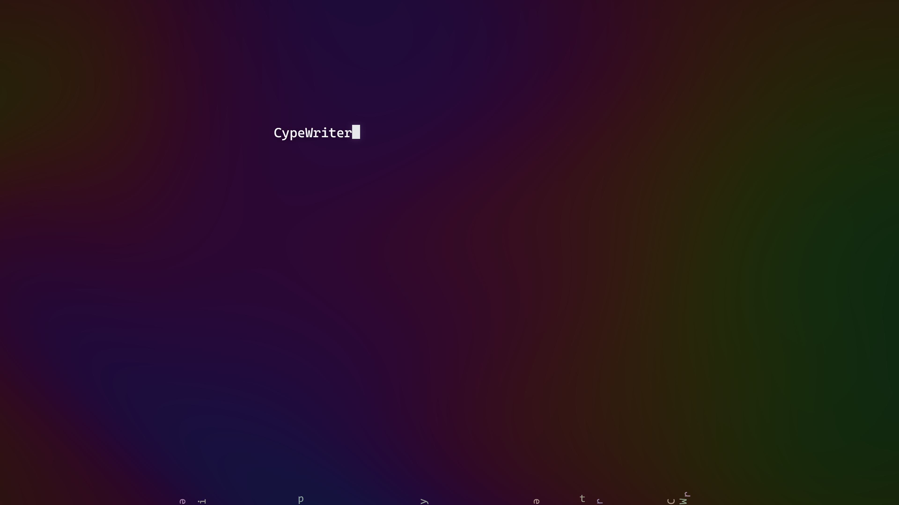

# Cypewriter

一个极简的互动打字空间。没有标题、按钮或计数器，只有终端式闪烁光标、缓慢变色的流体背景，以及随输入落下的字符。

[打开在线网站](https://jinda-quiet-typing.xyktl.chatgpt.site)

## 输入，让文字落下来

每输入一个字符，背景中就会出现一个对应的落字。字符受重力影响，从屏幕上方落下，旋转、碰撞和反弹，最终停在屏幕底部。输入得越多，落字就越会互相堆叠。

支持英文字母、中文和表情。中文输入法会在确认输入后生成落字，避免将拼音输入过程中的临时内容重复加入背景。空格和换行保留在正文中，不生成可见落字。

## 删除，让文字迸开彩纸

删除正文时，对应的背景落字会立即消失，在原来的位置迸开彩色纸屑，并响起一声短促、清脆的“啵”。支持退格、删除选区和整段清空；删除堆叠中的字符后，其余落字会继续受到重力影响。

## 流动的背景

- 实时生成的流体色彩缓慢流动，基础色相约三分钟完成一次完整循环。
- 移动鼠标会在指针附近产生柔和扰动。
- 文字区域保留原生编辑能力，支持选择、粘贴、撤销和移动端键盘。
- 页面在后台时暂停动画；落字静止后停止持续计算。
- 系统启用“减少动态效果”时，背景色彩停止流动，删除纸屑效果关闭。
- WebGL 不可用时，背景回退为静态渐变。

## 使用

打开在线网站，或直接用浏览器打开 `dist/index.html`。点击文字区域即可输入。

删除音效需要浏览器允许音频播放；如果没有声音，请先点击页面，并确认设备未静音。

输入的文字只保留在当前页面内存中，不会保存或上传。刷新或关闭页面后，正文和落字都会清空。

## 项目结构

```text
dist/
  index.html                 页面结构
  style.css                  极简排版与闪烁光标
  app.js                     输入光标与 WebGL 流体背景
  letters.js                 落字物理、删除纸屑与音效
  vendor/
    matter.min.js            Matter.js 0.20.0 物理引擎
    MATTER-LICENSE.txt       物理引擎的 MIT 许可
```

采用原生 HTML、CSS 和 JavaScript，使用 Matter.js 模拟重力与碰撞，使用 Web Audio API 合成删除音效。依赖已包含在项目中，无需安装或构建；部署时将 `dist` 作为静态网站目录即可。


